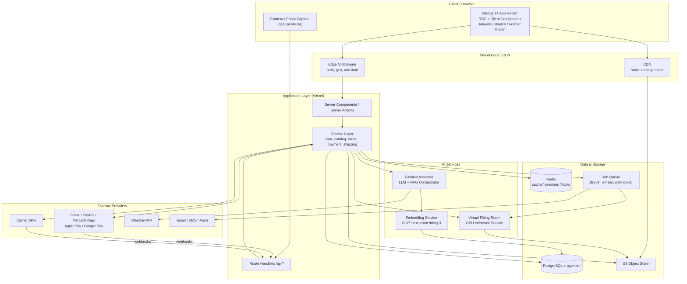
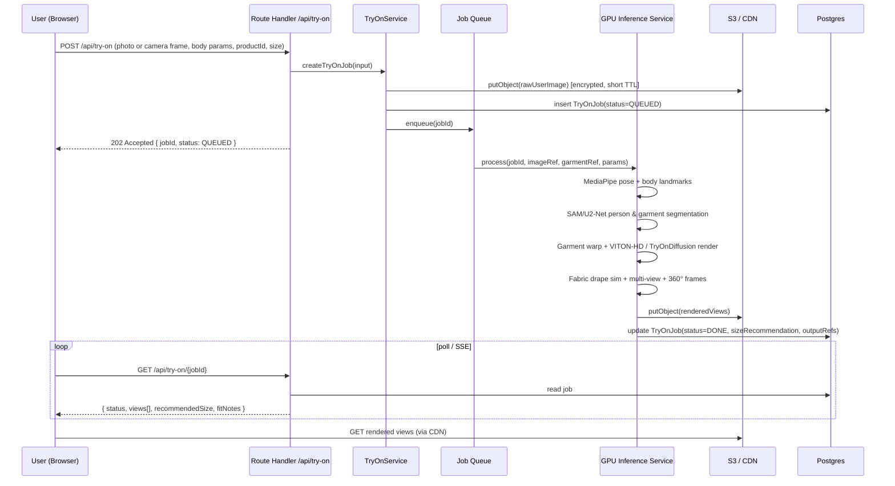
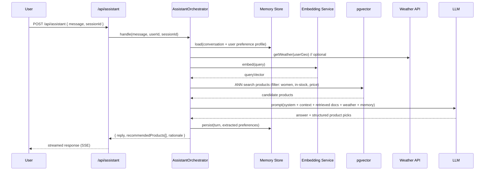
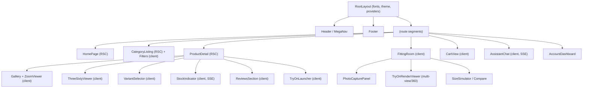
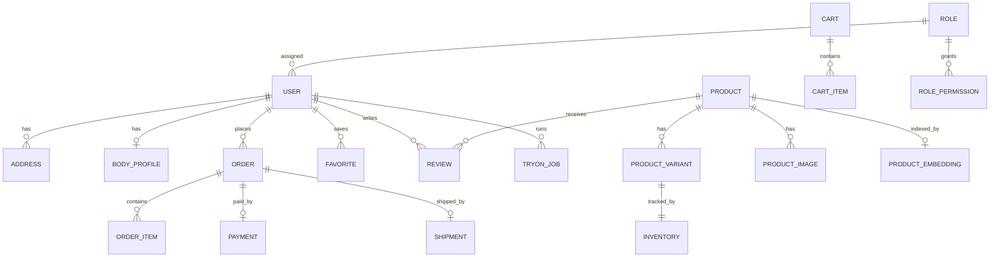
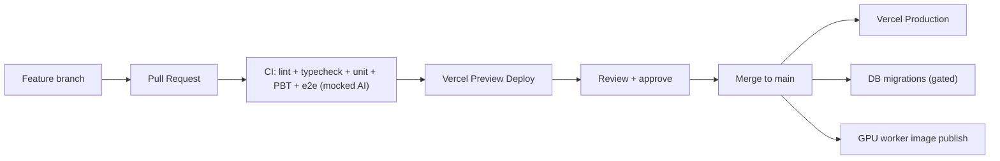

# Design Document: AURÉLLE — Luxury Women's Boutique

## Overview

**AURÉLLE** is a premium, women-only fashion e-commerce platform whose flagship differentiator is an **AI Virtual Fitting Room** that renders garments onto a shopper's own body, simulates fabric drape, and recommends sizes. The platform pairs a couture-grade storefront experience with an AI Fashion Assistant (LLM + RAG), smart vector search, a full admin/merchandising back office, multi-provider payments, and shipping orchestration.

The system is built on **Next.js 14 (App Router)** with **TypeScript**, styled with **Tailwind CSS**, **shadcn/ui**, and **Framer Motion** for refined motion design. Persistence is **PostgreSQL** with the **pgvector** extension for semantic/visual search and recommendation embeddings. Media and try-on renders are stored in **S3** behind a **CDN**, and the application is deployed on **Vercel** with heavy ML inference offloaded to a dedicated GPU inference service.

This document combines visual architecture (Mermaid diagrams, component breakdown, sequence flows) with code-first contracts (TypeScript interfaces, API specs, algorithmic specifications) and a set of property-based correctness invariants that govern cart math, inventory, pricing, size recommendation, and authorization.

### Brand Identity

| Attribute | Decision |
| --- | --- |
| **Brand name** | **AURÉLLE** — evokes *aura* + *aurum* (gold); a feminine, French-leaning luxury wordmark |
| **Tagline** | *"Dressed in light."* |
| **Logo concept** | Minimalist high-contrast serif wordmark `AURÉLLE` in letter-spaced caps. Monogram mark = a single `A` formed by two intersecting thin golden arcs (a stylized "aura"). Works as favicon, embossed packaging stamp, and animated loader (arcs draw-in on load via Framer Motion). |
| **Logo clear space** | Minimum padding equal to the cap-height of the `A` on all sides. |

### Luxury Palette

| Token | Hex | Usage |
| --- | --- | --- |
| `noir` | `#0B0B0C` | Primary text, footer, hero overlays |
| `champagne` | `#C5A47E` | Primary accent, CTAs, active states, monogram |
| `champagne-deep` | `#A8814F` | Hover/pressed accent |
| `ivory` | `#F7F3EC` | Page background |
| `blush` | `#E8D8D0` | Soft section backgrounds, badges |
| `taupe` | `#8A7F72` | Secondary text, captions |
| `line` | `#E4DDD2` | Hairline borders, dividers |
| `success` / `warn` / `danger` | `#5C7A5C` / `#C08A3E` / `#9B3D3D` | Muted, desaturated states to stay on-brand |

### Typography

| Role | Typeface | Notes |
| --- | --- | --- |
| Display / Headings | **Cormorant Garamond** (high-contrast serif) | Hero, section titles, product names |
| Body / UI | **Inter** (clean grotesque) | Paragraphs, controls, tables |
| Accent / Eyebrow | **Inter**, uppercase, tracked +0.18em | Category labels, badges |
| Numerics (prices) | **Inter** tabular-nums | Aligned price columns |

Type scale (rem): `0.75 / 0.875 / 1 / 1.25 / 1.5 / 2 / 3 / 4.5`. Generous line-height (1.6 body, 1.15 display) and whitespace reinforce the luxury feel.

---

## Architecture

### System Architecture (High Level)



### Architectural Principles

- **Server-first rendering**: Catalog, PDP, and content pages are React Server Components for SEO + fast first paint; interactivity (cart, try-on, assistant) is islands of Client Components.
- **Service layer isolation**: Route Handlers and Server Actions are thin; all business rules live in a typed service layer so they are unit/property testable independent of HTTP.
- **Offload heavy ML**: GPU-bound try-on inference never runs on Vercel serverless. It is dispatched to a dedicated GPU service (Modal / Replicate / RunPod / SageMaker) via an async job queue; the UI polls or subscribes for the result.
- **Idempotency + atomicity at the boundaries**: Payments, inventory decrements, and webhook handlers are idempotent and transactional.
- **Vector-native**: Product, image, and user-preference embeddings live in pgvector with HNSW indexes, powering search, recommendations, and RAG.

---

## Sequence Diagrams

### 1. AI Virtual Fitting Room (Try-On)



### 2. Checkout & Payment

```mermaid
sequenceDiagram
    participant U as User
    participant API as /api/checkout
    participant CART as CartService
    participant INV as InventoryService
    participant PAY as PaymentService
    participant PSP as PSP (Stripe/…)
    participant DB as Postgres

    U->>API: POST /api/checkout { cartId, address, method }
    API->>CART: priceCart(cartId)  // recompute server-side
    CART-->>API: { subtotal, tax, shipping, discount, total }
    API->>INV: reserveStock(cartItems)  // tx + row locks
    INV->>DB: SELECT ... FOR UPDATE; decrement reserved
    INV-->>API: reservationId (TTL)
    API->>PAY: createPaymentIntent(total, idempotencyKey)
    PAY->>PSP: createIntent
    PSP-->>PAY: clientSecret
    PAY-->>API: clientSecret
    API-->>U: clientSecret

    U->>PSP: confirmPayment(clientSecret)
    PSP-->>API: webhook payment_intent.succeeded (signed)
    API->>PAY: verifySignature + idempotent handle(eventId)
    PAY->>INV: commitReservation(reservationId)  // reserved -> sold
    PAY->>DB: create Order(status=PAID)
    PAY->>U: order confirmation (email/push via queue)
```

### 3. AI Fashion Assistant (LLM + RAG, weather-aware)



---

## Storefront Page Map

All pages live under the App Router. Public storefront pages requested:

| Page | Route | Notes |
| --- | --- | --- |
| Home | `/` | Hero, featured collections, editorial, try-on teaser |
| New Collection | `/new` | Latest drop, sorted by `releasedAt` |
| Dresses | `/c/dresses` | Category listing |
| Blouses | `/c/blouses` | Category listing |
| Pants | `/c/pants` | Category listing |
| Skirts | `/c/skirts` | Category listing |
| Jackets | `/c/jackets` | Category listing |
| Sets | `/c/sets` | Coordinated sets |
| Casual | `/c/casual` | Style facet |
| Elegant | `/c/elegant` | Style facet |
| Sale | `/sale` | Discounted items only |
| Accessories | `/c/accessories` | Bags, jewelry, scarves |
| Favorites / Wishlist | `/favorites` | Auth or guest (local) |
| Cart | `/cart` | Server-priced cart |
| Account | `/account` | Profile, addresses, body profile, orders |
| Order Tracking | `/orders/[id]/track` | Carrier status timeline |
| Contact | `/contact` | Form + store info |
| FAQ | `/faq` | Accordion |
| Blog / Journal | `/journal` and `/journal/[slug]` | Editorial content (CMS-driven) |
| Product Detail (PDP) | `/p/[slug]` | Gallery, zoom, 360°, variants, size guide, reviews, stock, wishlist, share, **Try-On** entry |
| Virtual Fitting Room | `/p/[slug]/try-on` and `/fitting-room` | Flagship feature |
| Search | `/search` | Vector + keyword hybrid |
| Admin | `/admin/**` | RBAC-gated back office |

### PDP Feature Components

- **Gallery + Zoom**: high-res image grid, hover/pinch zoom, lazy-loaded via `next/image`.
- **360° viewer**: frame-sequence spinner driven by drag/scrub.
- **Variants**: color + size selectors bound to `ProductVariant`.
- **Size guide**: modal with measurement table; deep-links into Try-On size simulation.
- **Reviews**: rating distribution, verified-purchase badge, photo reviews.
- **Real-time stock**: live `availableQty` via polling/SSE; "Only N left" badge.
- **Wishlist + Share**: add to favorites; Web Share API + copy link.

---

## Components and Interfaces

### Frontend Component Breakdown



### Core Service Interfaces (TypeScript)

```typescript
// ---------- Catalog ----------
interface CatalogService {
  getProductBySlug(slug: string): Promise<ProductDetail | null>;
  listByCategory(category: CategorySlug, opts: ListOptions): Promise<Paginated<ProductCard>>;
  getVariant(variantId: string): Promise<ProductVariant | null>;
  search(query: SearchQuery): Promise<SearchResult>; // hybrid keyword + vector
}

// ---------- Cart ----------
interface CartService {
  getCart(cartId: string): Promise<Cart>;
  addItem(cartId: string, variantId: string, qty: number): Promise<Cart>;
  updateQty(cartId: string, lineId: string, qty: number): Promise<Cart>;
  removeItem(cartId: string, lineId: string): Promise<Cart>;
  priceCart(cartId: string, ctx: PricingContext): Promise<PricedCart>; // authoritative
}

// ---------- Inventory ----------
interface InventoryService {
  getAvailable(variantId: string): Promise<number>;
  reserveStock(items: LineRef[], ttlSeconds: number): Promise<Reservation>;
  commitReservation(reservationId: string): Promise<void>;
  releaseReservation(reservationId: string): Promise<void>;
}

// ---------- Payments ----------
interface PaymentService {
  createIntent(input: CreateIntentInput): Promise<PaymentIntentResult>;
  handleWebhook(provider: PaymentProvider, raw: RawWebhook): Promise<WebhookOutcome>;
  refund(input: RefundInput): Promise<RefundResult>;
}

// ---------- Shipping ----------
interface ShippingService {
  quote(address: Address, parcel: Parcel): Promise<ShippingOption[]>;
  createShipment(orderId: string, optionId: string): Promise<Shipment>;
  getTracking(shipmentId: string): Promise<TrackingStatus>;
}

// ---------- AI ----------
interface TryOnService {
  createTryOnJob(input: TryOnInput): Promise<TryOnJob>;
  getJob(jobId: string): Promise<TryOnJob>;
  recommendSize(input: SizeRecInput): Promise<SizeRecommendation>;
  compareSizes(input: SizeCompareInput): Promise<SizeComparison>;
}

interface AssistantService {
  chat(input: AssistantInput): AsyncIterable<AssistantChunk>; // streamed
}

interface SearchService {
  embed(text: string): Promise<number[]>;
  vectorSearch(vec: number[], filter: SearchFilter, k: number): Promise<ProductCard[]>;
}

// ---------- Auth / RBAC ----------
interface AuthService {
  getSession(req: Request): Promise<Session | null>;
  hasPermission(session: Session, permission: Permission): boolean;
  assertPermission(session: Session, permission: Permission): void; // throws 403
}
```

---

## Data Models

### Entity Relationship Overview



### Type Definitions (TypeScript)

```typescript
type UUID = string;
type Money = number; // integer minor units (cents) to avoid float drift

type CategorySlug =
  | "dresses" | "blouses" | "pants" | "skirts"
  | "jackets" | "sets" | "accessories";

type StyleTag = "casual" | "elegant" | "new" | "sale";

interface Product {
  id: UUID;
  slug: string;
  name: string;
  description: string;
  category: CategorySlug;
  styleTags: StyleTag[];
  basePrice: Money;       // current list price, >= 0
  compareAtPrice?: Money; // original price when on sale; >= basePrice
  currency: "USD" | "EUR" | "ARS";
  releasedAt: string;     // ISO date
  active: boolean;
}

interface ProductVariant {
  id: UUID;
  productId: UUID;
  color: string;
  size: SizeLabel;        // "XS" | "S" | "M" | "L" | "XL" | numeric
  sku: string;
  priceOverride?: Money;  // optional per-variant price
}

interface Inventory {
  variantId: UUID;
  onHand: number;         // physical units, >= 0
  reserved: number;       // held by active reservations, >= 0
  // available = onHand - reserved, must be >= 0
  version: number;        // optimistic concurrency token
}

interface ProductImage {
  id: UUID;
  productId: UUID;
  url: string;            // CDN URL
  kind: "flat" | "model" | "detail" | "spin";
  position: number;
  spinFrame?: number;     // for 360° sequences
}

interface CartItem {
  id: UUID;
  variantId: UUID;
  qty: number;            // >= 1
  unitPriceSnapshot: Money;
}

interface Cart {
  id: UUID;
  userId?: UUID;          // null => guest cart
  items: CartItem[];
  couponCode?: string;
  updatedAt: string;
}

interface PricedCart {
  cartId: UUID;
  lines: { lineId: UUID; unitPrice: Money; qty: number; lineTotal: Money }[];
  subtotal: Money;        // Σ lineTotal
  discount: Money;        // >= 0, <= subtotal
  shipping: Money;        // >= 0
  tax: Money;             // >= 0
  total: Money;           // subtotal - discount + shipping + tax, >= 0
}

interface BodyProfile {
  userId: UUID;
  heightCm?: number;
  weightKg?: number;
  bust?: number; waist?: number; hips?: number;
  preferredFit?: "slim" | "regular" | "relaxed";
  consentToStoreImages: boolean; // privacy: explicit opt-in
}

interface Order {
  id: UUID;
  userId: UUID;
  items: OrderItem[];
  pricing: PricedCart;
  status: "PENDING" | "PAID" | "FULFILLING" | "SHIPPED" | "DELIVERED" | "CANCELLED" | "REFUNDED";
  createdAt: string;
}

interface Payment {
  id: UUID;
  orderId: UUID;
  provider: PaymentProvider;
  intentId: string;
  amount: Money;
  status: "REQUIRES_ACTION" | "PROCESSING" | "SUCCEEDED" | "FAILED" | "REFUNDED";
  idempotencyKey: string;
}

type PaymentProvider = "stripe" | "paypal" | "mercadopago" | "apple_pay" | "google_pay";

// ---------- AI / vector ----------
interface ProductEmbedding {
  productId: UUID;
  textVec: number[];  // 1536-d (text-embedding-3-small) — pgvector
  imageVec: number[]; // 512-d  (CLIP image) — pgvector
}

interface TryOnJob {
  id: UUID;
  userId?: UUID;
  productId: UUID;
  variantId: UUID;
  status: "QUEUED" | "PROCESSING" | "DONE" | "FAILED";
  inputImageRef: string;       // encrypted S3 ref, short TTL
  outputViewRefs: string[];    // multi-view + 360° frames
  recommendedSize?: SizeLabel;
  fitNotes?: string;
  createdAt: string;
}

// ---------- RBAC ----------
type Permission =
  | "catalog:read" | "catalog:write"
  | "order:read"   | "order:write" | "order:refund"
  | "user:read"    | "user:write"
  | "content:write"| "settings:write";

interface Role { id: UUID; name: "customer" | "support" | "merchandiser" | "admin" | "superadmin"; permissions: Permission[]; }
interface Session { userId: UUID; roleName: Role["name"]; permissions: Permission[]; }
```

### PostgreSQL / pgvector Notes

```sql
-- Vector columns + HNSW indexes for ANN search
ALTER TABLE product_embedding ADD COLUMN text_vec vector(1536);
ALTER TABLE product_embedding ADD COLUMN image_vec vector(512);
CREATE INDEX ON product_embedding USING hnsw (text_vec vector_cosine_ops);
CREATE INDEX ON product_embedding USING hnsw (image_vec vector_cosine_ops);

-- Inventory invariant enforced at the DB level
ALTER TABLE inventory ADD CONSTRAINT inv_nonneg
  CHECK (on_hand >= 0 AND reserved >= 0 AND on_hand - reserved >= 0);
```

---

## API Contracts

REST under `/api`. All responses are JSON; errors follow a shared envelope. Auth via secure HTTP-only session cookie; admin routes require RBAC permission checks in Edge middleware + service layer.

### Error Envelope

```typescript
interface ApiError {
  error: { code: string; message: string; details?: unknown };
  requestId: string;
}
```

### Endpoint Summary

| Method | Path | Auth | Description |
| --- | --- | --- | --- |
| GET | `/api/products` | public | List/filter products (`?category=&style=&sort=&page=`) |
| GET | `/api/products/:slug` | public | Product detail w/ variants, images, stock |
| GET | `/api/search` | public | Hybrid keyword+vector search (`?q=&k=`) |
| POST | `/api/search/visual` | public | Image-based search (CLIP embedding) |
| GET | `/api/cart/:id` | session | Get cart |
| POST | `/api/cart/:id/items` | session | Add item `{ variantId, qty }` |
| PATCH | `/api/cart/:id/items/:lineId` | session | Update qty |
| DELETE | `/api/cart/:id/items/:lineId` | session | Remove item |
| POST | `/api/cart/:id/price` | session | Authoritative re-price |
| POST | `/api/checkout` | session | Reserve stock + create payment intent (idempotent) |
| POST | `/api/webhooks/:provider` | signed | PSP/carrier webhooks (idempotent by event id) |
| POST | `/api/orders/:id/refund` | `order:refund` | Refund |
| GET | `/api/orders/:id/track` | owner/support | Tracking status |
| POST | `/api/try-on` | session/guest | Create try-on job (returns 202 + jobId) |
| GET | `/api/try-on/:jobId` | owner | Job status + render views |
| POST | `/api/try-on/size` | session | Size recommendation/compare |
| POST | `/api/assistant` | session/guest | Stream chat (SSE) |
| GET | `/api/favorites` / POST / DELETE | session | Wishlist CRUD |
| POST | `/api/reviews` | verified buyer | Submit review |
| `*` | `/api/admin/**` | RBAC | Catalog/order/user/content CRUD |

### Example Contract: Add to Cart

```typescript
// POST /api/cart/:id/items
interface AddItemRequest { variantId: UUID; qty: number; } // qty >= 1
interface AddItemResponse { cart: Cart; available: number; }
// 409 if requested qty exceeds available stock
```

### Example Contract: Checkout

```typescript
// POST /api/checkout
interface CheckoutRequest {
  cartId: UUID;
  shippingAddress: Address;
  shippingOptionId: string;
  provider: PaymentProvider;
  idempotencyKey: string; // client-generated UUID, dedupes retries
}
interface CheckoutResponse {
  orderId: UUID;
  clientSecret: string;   // PSP secret for client confirm
  pricing: PricedCart;    // server-authoritative
  reservationId: string;
  reservationExpiresAt: string;
}
```

---

## Algorithmic Specifications (Code-First)

### Cart Pricing

```typescript
function priceCart(cart: Cart, ctx: PricingContext): PricedCart
```

**Preconditions:**
- Every `item.qty >= 1`; every referenced variant resolves to a non-null price `>= 0`.
- `ctx.taxRate >= 0`; coupon (if any) resolves to a non-negative discount.

**Postconditions:**
- `subtotal === Σ (unitPrice_i × qty_i)`.
- `0 <= discount <= subtotal`.
- `shipping >= 0`, `tax >= 0`.
- `total === subtotal - discount + shipping + tax` and `total >= 0`.
- Pure: no mutation of `cart` or `ctx`.

### Inventory Reservation (atomic, non-negative)

```pascal
ALGORITHM reserveStock(items, ttl)
INPUT: items (variantId, qty), ttl in seconds
OUTPUT: Reservation

BEGIN
  BEGIN TRANSACTION
    FOR each line IN items DO
      row <- SELECT * FROM inventory WHERE variant_id = line.variantId FOR UPDATE
      ASSERT row.on_hand - row.reserved >= 0          // pre-state invariant
      IF (row.on_hand - row.reserved) < line.qty THEN
        ROLLBACK
        RAISE OutOfStock(line.variantId)
      END IF
      UPDATE inventory
        SET reserved = reserved + line.qty, version = version + 1
        WHERE variant_id = line.variantId
    END FOR
    reservation <- INSERT reservation(items, expires_at = now() + ttl)
  COMMIT
  RETURN reservation
END
```

**Preconditions:** all `line.qty >= 1`; inventory rows exist.
**Postconditions:** for every touched row, `on_hand - reserved >= 0` still holds; either all lines reserved or none (atomic); `reserved` increased by exactly the requested quantities.
**Loop invariant:** after processing line *k*, rows `1..k` are locked and have sufficient available stock.

### Webhook Idempotency

```pascal
ALGORITHM handleWebhook(provider, raw)
BEGIN
  ASSERT verifySignature(provider, raw)              // reject forged events
  eventId <- raw.id
  IF EXISTS processed_event(eventId) THEN
    RETURN AlreadyProcessed                           // idempotent no-op
  END IF
  BEGIN TRANSACTION
    applyEffect(raw)                                  // e.g., mark order PAID, commit reservation
    INSERT processed_event(eventId)
  COMMIT
  RETURN Processed
END
```

### Size Recommendation

```typescript
function recommendSize(input: SizeRecInput): SizeRecommendation
```

**Preconditions:** `input.availableSizes` is non-empty; body measurements present or default fit used.
**Postconditions:** `result.recommendedSize ∈ input.availableSizes`; `result.confidence ∈ [0, 1]`; if measurements are missing, falls back to the closest available size to the user's historical purchases (still within `availableSizes`).

### Authorization Check

```typescript
function assertPermission(session: Session, permission: Permission): void
```

**Postconditions:** returns normally **iff** `permission ∈ session.permissions` (which equals the permission set of the user's assigned role); otherwise throws `ForbiddenError`. A session's effective permissions are exactly the role's permissions — they are never widened by request input.

---

## AI Virtual Fitting Room (Flagship)

### Pipeline & ML Stack

```mermaid
graph LR
    IMG["User photo / camera frame + body params"] --> POSE["Pose & landmarks<br/>MediaPipe / BlazePose"]
    POSE --> SEG["Segmentation<br/>SAM + U2-Net (person & garment mask)"]
    SEG --> WARP["Garment warping<br/>(TPS / flow)"]
    WARP --> GEN["Try-on synthesis<br/>VITON-HD / TryOnDiffusion / IDM-VTON"]
    GEN --> DRAPE["Fabric drape sim<br/>(material params: weight, stretch, sheen)"]
    DRAPE --> VIEWS["Multi-view + 360° frame render"]
    VIEWS --> OUT["Encrypted S3 output + before/after"]
```



| Stage | Technology | Runs on |
| --- | --- | --- |
| Pose / body landmarks | **MediaPipe Pose / BlazePose** | GPU inference service (can also pre-run client-side for quick preview) |
| Person & garment segmentation | **SAM (Segment Anything)** + **U2-Net** | GPU inference service |
| Garment warping | TPS / appearance-flow | GPU inference service |
| Try-on synthesis | **VITON-HD** (baseline), **TryOnDiffusion / IDM-VTON** (diffusion, higher fidelity) | GPU inference service (Modal / Replicate / RunPod / SageMaker) |
| Fabric drape | physically-based drape parameters per fabric (`weightGsm`, `stretch`, `sheen`) modulating the diffusion conditioning | GPU inference service |
| Multi-view / 360° | sequential renders at N camera angles | GPU inference service |
| Orchestration / job state | Next.js Route Handlers + job queue | Vercel + queue |

**Why offloaded:** diffusion try-on is GPU- and latency-heavy and exceeds Vercel serverless limits. Jobs are enqueued; the UI shows progress and renders results from the CDN when `status=DONE`. A lightweight MediaPipe preview can run client-side (WASM) for instant pose feedback before the full render.

### Capabilities

- **Inputs:** uploaded photo or live camera capture (`getUserMedia`), plus optional body params from `BodyProfile`.
- **Garment-on-body render** with **fabric drape** tuned by material metadata.
- **Size simulation / recommendation / compare:** render the same garment in multiple sizes; recommend best fit; side-by-side compare.
- **Multi-view + 360°** rendered frames; **before/after** toggle.
- **Privacy:** raw user images are encrypted, short-TTL, and only stored when the user explicitly opts in (`consentToStoreImages`); otherwise deleted immediately after render.

---

## AI Fashion Assistant

- **LLM + RAG**: retrieval over `ProductEmbedding` (pgvector ANN) filtered to women's, in-stock, and budget constraints; the LLM composes styling advice and structured product picks.
- **Weather-aware**: optional geo → weather lookup biases recommendations (e.g., outerwear when cold, breathable fabrics when hot).
- **Memory**: per-session conversation history + a durable user **preference profile** (extracted style tags, sizes, color affinities) stored and re-injected on later sessions.
- **Streaming**: responses streamed via SSE for responsiveness.
- **Guardrails**: scope-limited to fashion/catalog; never invents out-of-catalog SKUs (grounded strictly in retrieved products).

---

## Smart Vector Search

- **Hybrid search**: keyword (Postgres full-text) **+** semantic (text embedding ANN) results fused by reciprocal-rank fusion.
- **Visual search**: upload an image → CLIP embedding → ANN over `image_vec`.
- **Recommendations**: "you may also like" via nearest neighbors on `text_vec`/`image_vec`, filtered by availability and category.
- **Index**: pgvector **HNSW** with cosine ops; filters (category, price, in-stock) applied as SQL predicates alongside the ANN.

---

## Admin Panel (CRUD + RBAC)

- **Sections**: Products & variants, inventory, orders & fulfillment, refunds, customers, reviews moderation, content/journal (CMS), promotions/coupons, settings.
- **RBAC roles**: `customer < support < merchandiser < admin < superadmin`, each mapping to a `Permission[]`. Every admin route enforces `assertPermission` in both Edge middleware and the service layer (defense in depth).
- **Audit log**: every write records actor, action, before/after, timestamp (supports the no-privilege-escalation property and traceability).

---

## State Management

| Concern | Mechanism |
| --- | --- |
| Server data (catalog, PDP, orders) | React Server Components + `fetch` cache / `revalidate` tags |
| Client server-state (cart, favorites, try-on polling) | **TanStack Query** (caching, retries, polling, SSE updates) |
| Ephemeral UI state (modals, mega-nav, filters) | **Zustand** stores (small, colocated) |
| Cart identity | secure cookie (`cartId`); guest carts merge into user cart on login |
| Auth/session | HTTP-only secure cookie; session read in Edge middleware |
| Forms | React Hook Form + Zod schema validation (shared client/server) |
| Assistant chat stream | SSE consumed into a Zustand chat store |

Principle: **server is the source of truth for money and stock** — client state never authoritatively computes totals or availability.

---

## Folder Structure

```text
src/
├── app/
│   ├── (storefront)/
│   │   ├── page.tsx                # Home
│   │   ├── new/page.tsx
│   │   ├── c/[category]/page.tsx    # dresses, blouses, pants, skirts, jackets, sets, accessories
│   │   ├── sale/page.tsx
│   │   ├── p/[slug]/page.tsx        # PDP
│   │   ├── p/[slug]/try-on/page.tsx
│   │   ├── fitting-room/page.tsx
│   │   ├── favorites/page.tsx
│   │   ├── cart/page.tsx
│   │   ├── account/**
│   │   ├── orders/[id]/track/page.tsx
│   │   ├── search/page.tsx
│   │   ├── journal/[slug]/page.tsx
│   │   ├── contact/page.tsx
│   │   └── faq/page.tsx
│   ├── admin/**                     # RBAC-gated
│   └── api/
│       ├── products/route.ts
│       ├── cart/[id]/**/route.ts
│       ├── checkout/route.ts
│       ├── try-on/[[...jobId]]/route.ts
│       ├── assistant/route.ts
│       ├── search/route.ts
│       └── webhooks/[provider]/route.ts
├── components/
│   ├── ui/                          # shadcn/ui primitives
│   ├── product/                     # Gallery, ZoomViewer, ThreeSixty, VariantSelector
│   ├── fitting-room/
│   ├── cart/
│   ├── assistant/
│   └── layout/                      # Header, MegaNav, Footer
├── services/                        # catalog, cart, inventory, payment, shipping, try-on, assistant, search, auth
├── lib/                             # db, redis, s3, embeddings, queue, money, rbac
├── db/                              # schema, migrations, seed
├── stores/                          # zustand stores
├── styles/                          # tailwind theme tokens (palette/typography)
└── tests/
    ├── unit/
    ├── property/                    # PBT (fast-check)
    └── e2e/                         # Playwright
```

---

## Error Handling

| Scenario | Condition | Response | Recovery |
| --- | --- | --- | --- |
| Out of stock at checkout | requested qty > available | `409 OUT_OF_STOCK` with available qty | UI offers max available / waitlist; reservation rolled back atomically |
| Reservation expired | TTL passed before payment | `410 RESERVATION_EXPIRED` | re-price + re-reserve |
| Payment failed | PSP declines | `402` + reason | release reservation; allow retry/alt method |
| Duplicate webhook | event id already processed | `200` no-op | idempotent dedupe table |
| Try-on failure | GPU error / bad image | job `FAILED` + reason | prompt re-upload; never charge; raw image purged |
| Assistant retrieval empty | no matching products | graceful "no exact match" + alternatives | broaden filters |
| Authz failure | missing permission | `403 FORBIDDEN` | logged to audit trail |

---

## Testing Strategy

### Unit Testing
- Pure service functions (pricing, discounts, size logic) with deterministic fixtures. Runner: **Vitest** (run via `vitest --run`).

### Property-Based Testing
- **Library:** **fast-check** (TypeScript).
- Targets the correctness properties below. Each property generates randomized carts, inventories, prices, and role/permission sets.

### Integration / E2E
- API route handlers against an ephemeral Postgres (+pgvector) and stubbed PSP/carrier.
- **Playwright** for storefront, PDP, cart→checkout, and fitting-room flows. AI/GPU calls are mocked in CI; a nightly job exercises a real GPU endpoint.

---

## Correctness Properties (Property-Based)

> Library: **fast-check**. These are the invariants that must hold for all generated inputs.

### P1 — Cart math
For any cart of valid line items:
- `pricedCart.subtotal === Σ(unitPrice_i × qty_i)`
- `total === subtotal - discount + shipping + tax`
- `0 <= discount <= subtotal` and `total >= 0`
- `priceCart` is pure (input cart unchanged).

```typescript
fc.assert(fc.property(arbCart(), arbPricingCtx(), (cart, ctx) => {
  const p = priceCart(cart, ctx);
  const expectedSubtotal = cart.items.reduce((s, i) => s + unitPrice(i) * i.qty, 0);
  expect(p.subtotal).toBe(expectedSubtotal);
  expect(p.discount).toBeGreaterThanOrEqual(0);
  expect(p.discount).toBeLessThanOrEqual(p.subtotal);
  expect(p.total).toBe(p.subtotal - p.discount + p.shipping + p.tax);
  expect(p.total).toBeGreaterThanOrEqual(0);
}));
```

### P2 — Non-negative inventory + atomic decrement
For any sequence of concurrent/interleaved reservations:
- `onHand - reserved >= 0` always holds.
- A reservation either fully succeeds (all lines) or makes no change (atomic).
- Total reserved equals the sum of successful reservation quantities (no lost/double decrement).

```typescript
fc.assert(fc.property(arbInventory(), arbReservationOps(), (inv, ops) => {
  const final = applyReservations(inv, ops); // simulates row-locked, transactional decrements
  for (const row of final.rows) {
    expect(row.onHand - row.reserved).toBeGreaterThanOrEqual(0);
  }
  expect(totalReserved(final)).toBe(sumOfCommittedQuantities(ops));
}));
```

### P3 — Pricing invariants
For any product:
- `basePrice >= 0`; if `compareAtPrice` set then `compareAtPrice >= basePrice` (sale price never exceeds original).
- Effective sale price is within `[0, compareAtPrice]`.
- Applying a percentage discount `d ∈ [0,1]` yields `0 <= salePrice <= original`.

```typescript
fc.assert(fc.property(arbProduct(), fc.float({ min: 0, max: 1 }), (prod, d) => {
  const sale = applyDiscount(prod.basePrice, d);
  expect(sale).toBeGreaterThanOrEqual(0);
  expect(sale).toBeLessThanOrEqual(prod.basePrice);
  if (prod.compareAtPrice !== undefined) {
    expect(prod.compareAtPrice).toBeGreaterThanOrEqual(prod.basePrice);
  }
}));
```

### P4 — Size recommendation ∈ available sizes
For any body profile and any non-empty available-size set:
- `recommendSize(...).recommendedSize ∈ availableSizes`
- `confidence ∈ [0, 1]`.

```typescript
fc.assert(fc.property(arbBodyProfile(), arbNonEmptySizeSet(), (body, sizes) => {
  const rec = recommendSize({ body, availableSizes: sizes });
  expect(sizes).toContain(rec.recommendedSize);
  expect(rec.confidence).toBeGreaterThanOrEqual(0);
  expect(rec.confidence).toBeLessThanOrEqual(1);
}));
```

### P5 — Auth: no privilege escalation
For any user with role `r` and any request:
- Effective permissions == `role(r).permissions` (no widening from request input).
- `assertPermission(session, p)` succeeds **iff** `p ∈ role(r).permissions`.
- No sequence of normal requests grants a permission the role lacks.

```typescript
fc.assert(fc.property(arbRole(), arbPermission(), arbRequest(), (role, perm, req) => {
  const session = buildSession(role, req); // request input must NOT expand permissions
  expect(new Set(session.permissions)).toEqual(new Set(role.permissions));
  const allowed = role.permissions.includes(perm);
  if (allowed) {
    expect(() => assertPermission(session, perm)).not.toThrow();
  } else {
    expect(() => assertPermission(session, perm)).toThrow();
  }
}));
```

---

## Performance & Scalability

- **Rendering**: RSC + streaming; static generation for catalog/PDP with on-demand revalidation (ISR) on product updates.
- **Images**: `next/image` with AVIF/WebP, responsive sizes, CDN edge caching; 360°/spin frames lazy-loaded and pre-warmed on hover.
- **Caching**: Redis for hot reads (product, available stock), cache tags invalidated on writes; PSP/idempotency dedupe keys in Redis.
- **Vector search**: HNSW indexes; ANN `k` bounded; pre-filtered by SQL predicates to keep candidate sets small.
- **AI try-on**: queue + autoscaling GPU workers; backpressure with per-user concurrency caps; results cached per (user, garment, size) hash.
- **Targets (initial)**: storefront TTFB < 300ms (edge), PDP LCP < 2.5s, search p95 < 400ms, checkout API p95 < 600ms (excluding PSP), try-on render typically 5–20s async.

---

## Security Architecture

- **Auth**: secure HTTP-only, SameSite cookies; session rotation; optional 2FA for admin; OAuth social login.
- **RBAC**: least-privilege roles; permission checks in Edge middleware **and** service layer; audit log on all writes.
- **CSRF**: double-submit token / SameSite cookies on state-changing requests; Server Actions use framework CSRF protection.
- **XSS**: React auto-escaping; strict Content-Security-Policy; sanitize CMS/journal HTML; no `dangerouslySetInnerHTML` without sanitization.
- **Rate limiting**: per-IP/per-user limits on auth, checkout, try-on, and assistant endpoints (Redis token bucket) at the edge.
- **Encryption**: TLS in transit; encryption at rest for DB and S3; try-on raw images encrypted with short TTL and consent-gated retention.
- **PCI**: card data never touches our servers — handled by PSP SDKs/Elements; we store only tokens/intent ids; scope minimized to SAQ-A.
- **Webhooks**: signature verification + idempotency dedupe; reject unsigned/forged events.
- **Secrets**: managed via Vercel/secret store; no secrets in client bundles.
- **Privacy**: explicit consent for body images; data deletion/export endpoints (GDPR/CCPA).

---

## Deployment & CI/CD



- **CI gates**: ESLint, `tsc --noEmit`, Vitest unit, fast-check property tests, Playwright e2e (AI/PSP mocked).
- **Preview environments**: every PR gets a Vercel preview with an isolated DB branch.
- **Migrations**: versioned, forward-only, run as a gated step before promoting production.
- **GPU workers**: containerized try-on models deployed/scaled independently of the web app.
- **Observability**: structured logs + request ids, error tracking (Sentry), metrics/alerts on checkout, payment, and try-on queues.
- **Rollback**: instant Vercel rollback to previous deployment; migrations designed to be backward compatible.

---

## Seed Data Strategy

- **Catalog**: ~80–120 demo products spread across all categories (dresses, blouses, pants, skirts, jackets, sets, accessories) with realistic luxury names, prices (cents), `compareAtPrice` for ~20% on sale, and `styleTags` (`casual`/`elegant`/`new`/`sale`).
- **Variants & inventory**: each product gets 2–4 colors × standard size runs; inventory seeded with non-negative `onHand`, `reserved=0` to satisfy the inventory invariant from day one.
- **Images**: placeholder CDN images including flat, model, detail, and a spin set for at least a few products to exercise 360°.
- **Embeddings**: generate `text_vec`/`image_vec` for every product during seed so search/RAG work immediately; deterministic seed for reproducible tests.
- **Users & roles**: one user per role (`customer`, `support`, `merchandiser`, `admin`, `superadmin`) with correct permission sets to validate RBAC and the no-escalation property.
- **Orders/reviews**: a handful of historical orders + verified-purchase reviews to populate dashboards and rating distributions.
- **Idempotency**: seed script is re-runnable (upsert by stable slug/sku) so re-seeding never duplicates rows or violates constraints.

---

## Dependencies

| Category | Choice |
| --- | --- |
| Framework | Next.js 14 (App Router), React 18, TypeScript |
| Styling/UI | Tailwind CSS, shadcn/ui, Framer Motion, Radix primitives |
| Data | PostgreSQL + pgvector, Prisma (or Drizzle) ORM, Redis |
| Storage/CDN | S3-compatible object store + CDN |
| Payments | Stripe, PayPal, MercadoPago, Apple Pay, Google Pay |
| AI (try-on) | MediaPipe/BlazePose, SAM, U2-Net, VITON-HD / TryOnDiffusion / IDM-VTON on Modal/Replicate/RunPod/SageMaker |
| AI (assistant/search) | LLM (GPT-4o / Claude), text-embedding-3, CLIP, RAG over pgvector |
| Validation | Zod, React Hook Form |
| State | TanStack Query, Zustand |
| Testing | Vitest, fast-check, Playwright |
| Infra/CI | Vercel, GitHub Actions, Sentry |
| External | Weather API, Email/SMS/Push providers, Carrier tracking APIs |
```

---

## Next Steps

With the design approved, the natural progression is to **derive formal requirements** (EARS-style acceptance criteria traced back to these design decisions), and then break the work into an actionable **task list** for implementation.
